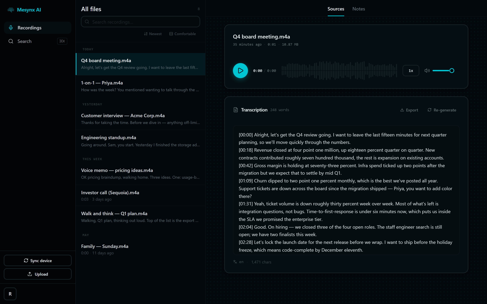
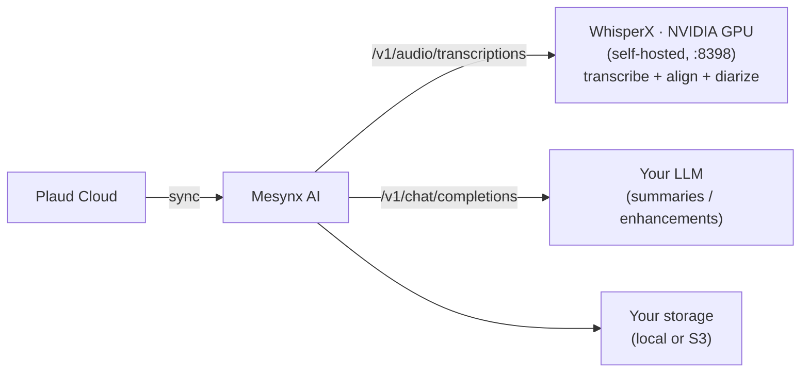
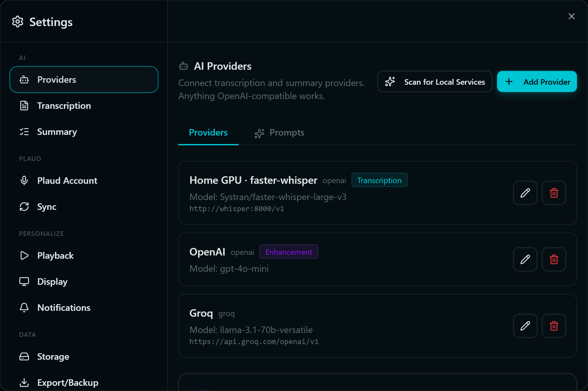

<!-- markdownlint-disable MD033 MD041 -->

<div align="center">


**Open-source AI transcription companion for voice recorders.**

*Bring your own AI provider, own your transcripts, self-host or hosted.*

[](LICENSE)
[](https://discord.gg/mgBKaEGUvc)

[Quick start](#quick-start) • [What's new vs. Riffado](#whats-new-in-mesynx-ai-vs-riffado) • [Documentation](https://mesynx.jewell-net.com/docs) • [Discord](https://discord.gg/mgBKaEGUvc)

</div>

---

> **Mesynx AI is a self-hosting-first distribution of [Riffado](https://github.com/riffado/riffado)** (which was formerly *OpenPlaud*). It tracks Riffado's core and adds first-class **self-hosted GPU transcription with speaker diarization**, an **editable transcription workspace**, and hardened **AI-provider management**. Same AGPL-3.0 license as its upstream. [See exactly what's different ↓](#whats-new-in-mesynx-ai-vs-riffado)

Mesynx AI is an open-source companion app for AI voice recorders. It syncs your recordings from the manufacturer's cloud, transcribes them with any OpenAI-compatible API — **a remote provider, the browser for free, or your own GPU** — and stores everything on infrastructure you control. **Currently supports the Plaud Note family — Note, Note Pro, and NotePin. More device support on the way.** AGPL-3.0.



## Features

- **Self-hosted GPU transcription with diarization** — a bundled [WhisperX](https://github.com/etalab-ia/whisperx-openai-api) service (NVIDIA), turnkey in Docker Compose. Transcription, forced alignment, and *who spoke when*. No external API required. *(New in Mesynx AI.)*
- **Speaker names that propagate** — name a speaker once, anywhere, and it appears in the transcript, the summary prose, key points, action items, and the workspace. Renaming stays retroactive because raw ids are what get stored. *(New in Mesynx AI.)*
- **Editable transcription workspace** — reshape a recording's summary into a tree you own, viewed three ways: a hand-arranged mind map, an Obsidian-style force graph, and an indented outline. Every section carries the transcript that supports it. *(New in Mesynx AI.)*
- Works with any OpenAI-compatible provider — OpenAI, Groq, OpenRouter, Together, LM Studio, Ollama, Azure, anything with a `baseURL`.
- Free browser transcription via Transformers.js (Whisper in WebAssembly).
- Self-hosted. Your recordings, your storage, your API keys.
- Local filesystem or S3-compatible storage (AWS S3, Cloudflare R2, MinIO, Backblaze B2, DigitalOcean Spaces, Wasabi).
- AES-256-GCM encryption at rest for tokens, API keys, transcripts, and summaries.
- Auto-sync on a schedule, with browser and email notifications.
- Full export and backup — JSON, TXT, SRT, VTT, plus one-archive backup/restore.
- Automation API with signed webhooks for integrations.
- Zero-config Docker Compose deploy.

## What's new in Mesynx AI (vs. Riffado)

Everything Riffado does, Mesynx AI does too — these are the changes layered on top.

| Area | Riffado | Mesynx AI |
| --- | --- | --- |
| **Transcription backend** | Bring-your-own OpenAI-compatible API | **+ Bundled self-hosted GPU WhisperX** (NVIDIA), turnkey in `docker-compose.yml` |
| **Local AI servers** | Chat / text only (Ollama, Open WebUI) — `405` on `/v1/audio/transcriptions` | Real `/v1/audio/transcriptions` via WhisperX — **your local box can finally transcribe** |
| **Speaker diarization** | None | **Who spoke when**, with click-to-rename labels that propagate to every surface |
| **Summary view** | Static text | **Editable workspace** — mind map, force graph, and outline over one tree, with transcript evidence under every section |
| **Provider setup** | Provider + key + model | **+ Nickname** per server · **+ searchable model picker** (auto-discovered on *Test Connection*) |
| **Provider reliability** | Saved configs occasionally failed to load / lost the key on open | Section self-loads with a spinner; **configs and keys load reliably** |
| **Brand** | Riffado (formerly OpenPlaud) | **Mesynx AI** |

### 🎙️ Self-hosted GPU transcription

Riffado expects an OpenAI-compatible transcription endpoint. The catch: popular *local* AI servers like **Ollama** and **Open WebUI** only implement chat/completions — they return **`405 Method Not Allowed`** on `/v1/audio/transcriptions`, so they can't transcribe audio at all.

Mesynx AI closes that gap by bundling a GPU [WhisperX](https://github.com/etalab-ia/whisperx-openai-api) service that speaks the OpenAI audio API natively — and adds forced alignment and speaker diarization on top:

```yaml
# docker-compose.yml (already included)
whisperx:
  image: ghcr.io/etalab-ia/whisperx-openai-api:latest
  container_name: mesynx-whisperx
  restart: unless-stopped
  ports:
    - "8398:8000"
  environment:
    - HF_TOKEN=${HF_TOKEN:-}          # required; see setup below
    - BATCH_SIZE=${WHISPERX_BATCH_SIZE:-4}
  deploy:
    resources:
      reservations:
        devices:
          - driver: nvidia
            device_ids: ["0"]
            capabilities: [gpu]
```

Then point a provider's **Base URL** at it — `http://whisperx:8000/v1` from inside Compose, or `http://<host>:8398/v1` from another machine on your network — with model `large-v3-turbo-diarize`. The `-diarize` suffix is what requests speaker separation.



> **A GPU is required.** There is no CPU image for WhisperX. Setup also needs a Hugging Face token (the diarization models are gated) and a one-time `./patches/apply.sh`. The [transcription server guide](https://github.com/r0073d-l053r/mesynx/blob/main/content/docs/self-hosting/whisper-server.mdx) walks through both — the one-line installer handles them for you.

Running it on a separate GPU box is supported too — see [`whisper-server/`](whisper-server/) for a standalone compose file.

### 🗣️ Speaker diarization, with names that stick

Diarized transcripts arrive split by speaker. Click any label, type a name, and it appears **everywhere at once** — transcript, summary prose, key points, action items, workspace nodes, tags, breadcrumbs.

That works because Mesynx AI stores the raw `SPEAKER_NN` ids and resolves names only when rendering. So a rename is retroactive — it reaches summaries generated weeks ago — and repeatable, because nothing was ever frozen into the text. The summary model is deliberately shown the raw ids for the same reason.

See [Speakers and diarization](https://github.com/r0073d-l053r/mesynx/blob/main/content/docs/guides/speakers-and-diarization.mdx).

### 🧠 Editable transcription workspace

Each recording's AI summary becomes a **tree you can edit**, not a static block of text — rename, regroup, split, delete — with three views over the same data:

- **Mind map** — hand-arranged cards you drag where you want them; positions persist.
- **Graph** — an Obsidian-style force graph that solves and then *freezes*, so it never drifts while you read it. Drag a node and neighbours flow around it; release and it pins where you dropped it.
- **Document** — the same tree as an inline-editable outline.

Selecting a node opens a detail pane with a clickable breadcrumb, its connections, and **the transcript that supports it** — grouped by which child owns each run, so you can go from a summary claim to the words behind it.

See [Transcription workspace](https://github.com/r0073d-l053r/mesynx/blob/main/content/docs/guides/transcription-workspace.mdx).

### 🔌 Hardened AI provider management

- **Nickname any server.** Custom and self-hosted endpoints get a friendly label — "Home GPU · WhisperX" is a lot easier to manage than a bare IP address.
- **Searchable model picker.** Hit **Test Connection** and Mesynx AI queries the server's `/v1/models` endpoint, then replaces the blank text field with a live type-to-filter dropdown. No more guessing exact model IDs.
- **Reliable loading.** The Providers section self-fetches on open with a loading state, fixing the race condition in Riffado where saved configs — or their API keys — sometimes failed to appear.

<p align="center">

</p>

<p align="center">
  <video src=".github/assets/add-provider-demo.mp4" width="480" autoplay loop muted playsinline controls></video>
</p>
<p align="center"><sub>Adding a custom provider — nickname, test connection, and searchable model picker in action.</sub></p>

## Quick start

You need Docker, a Plaud account at [plaud.ai](https://plaud.ai), and (optionally) an OpenAI-compatible API key. For GPU transcription you'll also want NVIDIA drivers + the [NVIDIA Container Toolkit](https://docs.nvidia.com/datacenter/cloud-native/container-toolkit/latest/install-guide.html).

**One-liner (Linux / macOS):**

```bash
curl -fsSL https://raw.githubusercontent.com/r0073d-l053r/mesynx/main/scripts/install.sh | sh
```

Prompts for an install directory and `APP_URL`, downloads `docker-compose.yml` and `.env`, generates secrets, starts the stack, and waits for `/api/health`. Source: [`scripts/install.sh`](scripts/install.sh).

**Clone and Build from Source:**

```bash
git clone https://github.com/r0073d-l053r/mesynx.git
cd mesynx-ai

# Create .env from template
cp .env.example .env

# Automatically generate and configure required secrets
sed -i.bak "s/BETTER_AUTH_SECRET=.*/BETTER_AUTH_SECRET=\$(openssl rand -hex 32)/" .env && rm -f .env.bak
sed -i.bak "s/ENCRYPTION_KEY=.*/ENCRYPTION_KEY=\$(openssl rand -hex 32)/" .env && rm -f .env.bak

# Edit .env and customize options (e.g. SMTP or S3) if needed

sudo docker compose up -d --build
```

The stack runs all necessary services (app, database, and whisper server) in the same Docker network (`mesynx-network`), resolving each other out of the box.

Open <http://localhost:8790/register> and create your account. The onboarding wizard handles Plaud connection, AI providers, storage, and sync preferences.

**Upgrade:** `docker compose pull && docker compose up -d`. Migrations run on container start.

Full install guide, version pinning, image tags, and Windows/WSL notes: [mesynx.jewell-net.com/docs/self-hosting/install](https://mesynx.jewell-net.com/docs/self-hosting/install).

> `main` is a rolling integration branch. Deploy from tagged image releases, not by building `main`. See [BRANCHING.md](BRANCHING.md).

## Connecting Plaud

Mesynx AI signs into Plaud using your email — the same OTP flow as the official app. The verification code is forwarded directly to Plaud and never stored. Your access token is encrypted with AES-256-GCM before hitting the database. Region (Global, EU, APAC) is auto-detected.

If you signed up to Plaud with **Continue with Google** or **Continue with Apple**, the email-code flow won't return any recordings — that's a different identity on Plaud's side. Use the [Mesynx AI Connector browser extension](https://github.com/r0073d-l053r/mesynx/tree/main/chrome-extension), or paste a token manually. Full instructions: [mesynx.jewell-net.com/docs/guides/connect-plaud-account](https://mesynx.jewell-net.com/docs/guides/connect-plaud-account).

> Every line that handles your credentials is open source — [send-code route](src/app/api/plaud/auth/send-code/route.ts) · [verify route](src/app/api/plaud/auth/verify/route.ts) · [encryption](src/lib/encryption.ts).

## Documentation

Everything lives at **[mesynx.jewell-net.com/docs](https://mesynx.jewell-net.com/docs)**. Direct links:

- [Install & first run](https://mesynx.jewell-net.com/docs/self-hosting/install)
- [Self-hosted GPU transcription (Whisper)](whisper-server/) — model selection + VAD for long recordings
- [Environment variables](https://mesynx.jewell-net.com/docs/self-hosting/environment-variables)
- [Upgrading](https://mesynx.jewell-net.com/docs/self-hosting/upgrading)
- [S3-compatible storage](https://mesynx.jewell-net.com/docs/self-hosting/storage-s3)
- [Email / SMTP](https://mesynx.jewell-net.com/docs/self-hosting/email-smtp)
- [Connect your Plaud account](https://mesynx.jewell-net.com/docs/guides/connect-plaud-account)
- [AI providers](https://mesynx.jewell-net.com/docs/guides/ai-providers)
- [Backup & restore](https://mesynx.jewell-net.com/docs/guides/backup-and-restore)
- [Notifications](https://mesynx.jewell-net.com/docs/guides/notifications)
- [Automation & webhooks](https://mesynx.jewell-net.com/docs/guides/automation-and-webhooks)
- [Public API reference](https://mesynx.jewell-net.com/docs/reference/public-api)
- [Encryption at rest](https://mesynx.jewell-net.com/docs/reference/encryption-at-rest)
- [Security model](https://mesynx.jewell-net.com/docs/reference/security-model)
- [Architecture](https://mesynx.jewell-net.com/docs/reference/architecture)

## Contributing

Bug reports, feature requests, and PRs welcome. See [CONTRIBUTING.md](CONTRIBUTING.md) for local setup and the PR workflow, [BRANCHING.md](BRANCHING.md) for the release model, and [CHANGELOG.md](CHANGELOG.md) for version history.

## Security

Found a vulnerability? See [SECURITY.md](SECURITY.md) for disclosure.

## License

AGPL-3.0 — see [LICENSE](LICENSE). Free to use, modify, and self-host. If you run a modified version as a network service, you must publish your source. As a derivative of Riffado, Mesynx AI carries the same license and its source obligations upstream.

## Disclaimer

- **Not affiliated.** Mesynx AI is an independent open-source project. It is not affiliated with, endorsed by, or sponsored by Plaud Inc. or any of its subsidiaries. "Plaud" and related marks are the property of their respective owners and are used here only for descriptive interoperability purposes (nominative fair use).
- **Third-party devices and services.** Mesynx AI is designed to interoperate with hardware and services from third parties that users choose to connect — including recording devices (such as Plaud) and storage and AI providers. Users are solely responsible for complying with the applicable terms of service, acceptable-use policies, and laws governing any third-party device or service they connect to this software.

## Acknowledgments

Built on **[Riffado](https://github.com/riffado/riffado)** (originally *OpenPlaud*), created by **Perier** and its contributors. Mesynx AI extends that work with self-hosted GPU transcription and diarization, the editable transcription workspace, and provider-management improvements.
